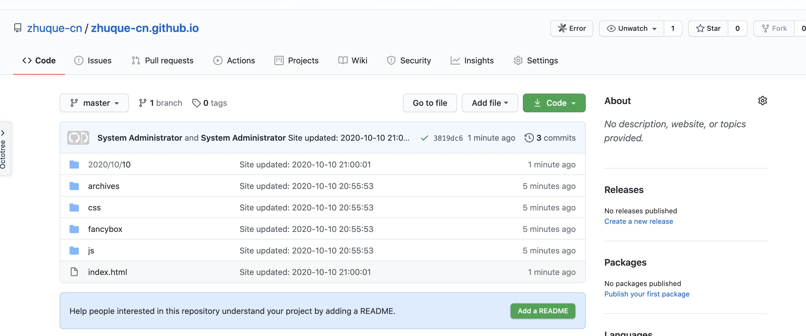
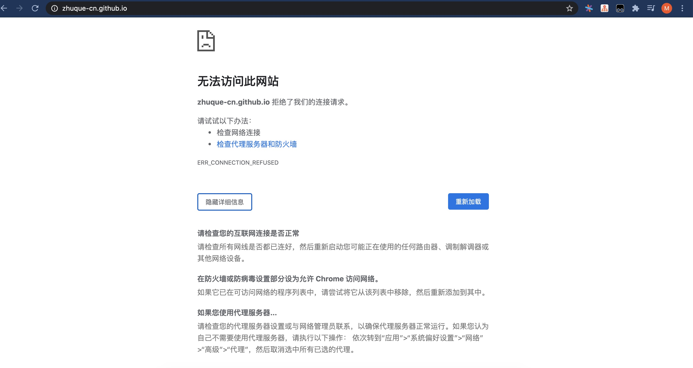

# 
个人博客搭建步骤--基于hexo

## 第一步 下载并安装node.js
>下载node.js : https://nodejs.org/zh-cn/
安装node.js文件, 安装完成包括Node.js和npm
    this package will install:
	•	Node.js v12.19.0 to /usr/local/bin/node
	•	npm v6.14.8 to /usr/local/bin/npm
检查node.js安装情况
    •	查看node/npm的安装情况: node -v  npm -v
    •	查询到上述两个软件的版本号说明安装ok
## 第二步 更换npm镜像源(更换为淘宝的镜像源)
>终端切换为root用户   sudo su
切换镜像源: npm install -g cnpm --registry=https//:registry.npm.taobao.org
查看cnpm安装情况 : cnpm -v
## 第三步 通过cnpm安装hexo客户端
> 安装hexo-cli : cnpm install -g hexo-cli
查看hexo安装情况: hexo -v

## 第四步 创建blog文件夹,并通过hexo进行初始化
>创建博客目录: mkdir blog 
切换到创建目录: cd blog
初始化文件夹: sudo hexo init
本地启动hexo: hexo s 
访问hexo博客页面:http://localhost:4000
关闭本地服务: ctrl + c

## 第五步 编写博客文章,并通过本地发布
>切换到blog路径下: cd blog
生成博客: hexo n "第一篇博客"
编写博客: vim 第一篇博客 
清理hexo缓存区: hexo clean
更新hexo: hexo g
本地启动hexo: hexo s
访问更新后的博客: http://localhost:4000/

# 第六步 将本地的博客部署到github上去
> 准备仓库: 注册并登录github, 创建部署日志的仓库(注意仓库名前半部分必须与账户名相同)

安装hexo的git插件: cnpm install --save hexo-deployer-git (注意: 安装是在blog目录下执行)
blog文件配置GitHub: 修改blog目录下的配置文件_config.yml

>将blog部署到远端 : hexo d
访问博客: https://zhuque-cn.github.io

 # 第七步 自定制博客主题
 >在github下载喜欢的主题 存放到本地blog下的themes目录下:
  · 切换到themes目录: cd themes  
  · 下载主题: git clone https://github.com/Shen-Yu/hexo-theme-ayer.git themes/ayer
  · 更改主题名: mv hexo-theme-butterfly butterfly 
 修改配置文件: 
  · 修改_config.yml : theme: ayer

更新blog的配置:
  · 本地更新并启动: hexo clean      hexo g      hexo s

  · 将blog推送到远端: hexo d

---
# 注意事项

### 问题1 通过浏览器访问https://*.github.io/ 时通过外网可以访问, 但国内网络无法正常访问
>内网访问显示结果

### 问题1解决办法如下: 
>增加DNS服务器备用地址: 208.67.222.222

### 问题2 : 直接插入图片会存在问题, 无法显示
>访问结果

### 问题2解决办法如下:
>· 修改根blog目录下的配置文件 : vim _config.yml   将post_asset_folder的赋值改为true
· 安装hexo-asset-image插件 : yarn add https://github.com/CodeFalling/hexo-asset-image
· 完成上述操作在blog下创建博客会自动配套生成图片文件夹,将图片放置于其中即可

