## <center>如何在Mac搭建c/c++入门开发环境--基于vscode</center>

#### 第1步 安装clang/gcc环境
`方法1: 直接安装所需要的环境,参考文章:https://blog.csdn.net/qq_33154343/article/details/104639656 `
`方法2: 在APP Store中安装xcode, xcode安装过程中会直接安装好c/c++等的基础环境 clang/clang++/gcc/gcc++都会安装,非常方便`
`安装完成xcode后,默认是不会安装Command Line Tools,这时需要对其进行安装:  xcode-select --install`

#### 第2步 安装vscode并配置vscode基础
`vscode安装: 直接在官网下载后解压将app拖入应用程序中即可`
`vscode配置code快捷命令(配置完成,在文件夹目录下直接输入code ./即可用过vscode打开所在文件夹): cmd+shift+p > install 'code' command in path`
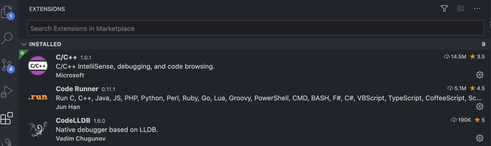

### 第3步 在vscode中安装c/c++开发所需要的插件
`必要插件有: C/C++  CodeLLDB CpdeRunner`


### 第4部 新建一个c语言程序
- 创建一个项目
```shell
创建一个文件夹: mkdir demo1
切换到该文件夹,并用vscode打开: cd demo1  >   code ./
```
- 编写c程序hello.c


### 第5部 调试c语言程序
#### 方法1 直接通过c++(GDB/LLDB)调试
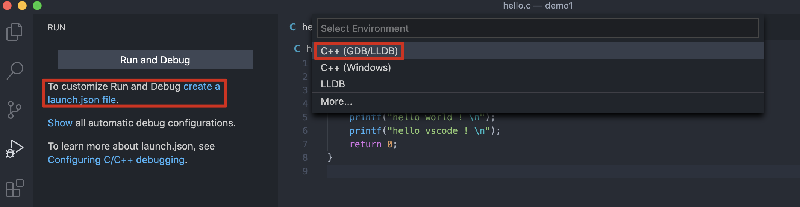
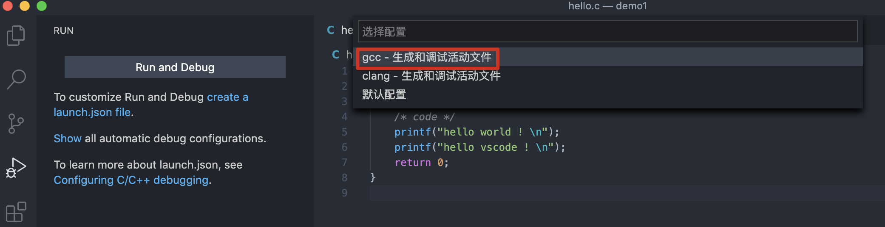
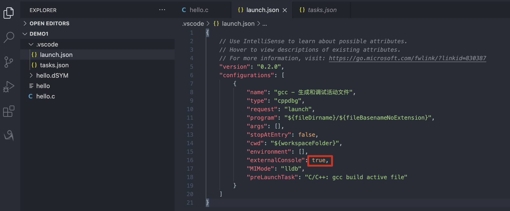
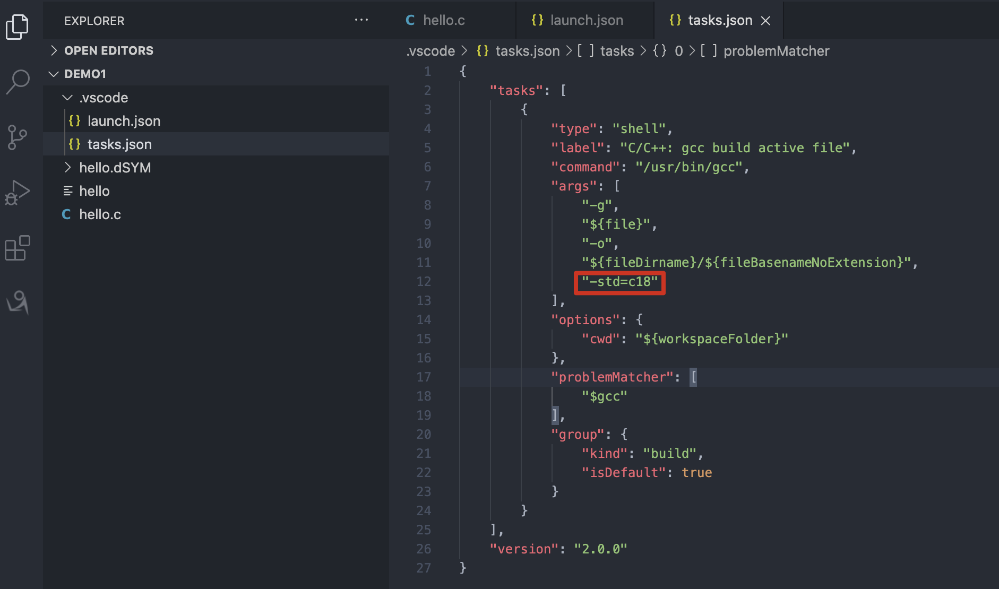
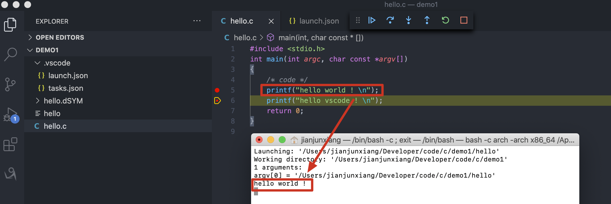

#### 方法2 直接通过LLDB插件调试
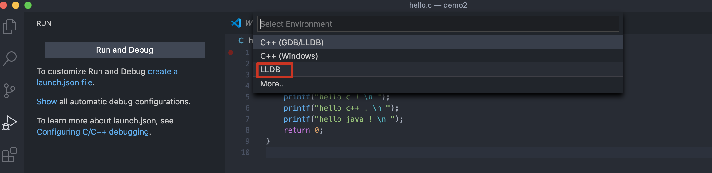
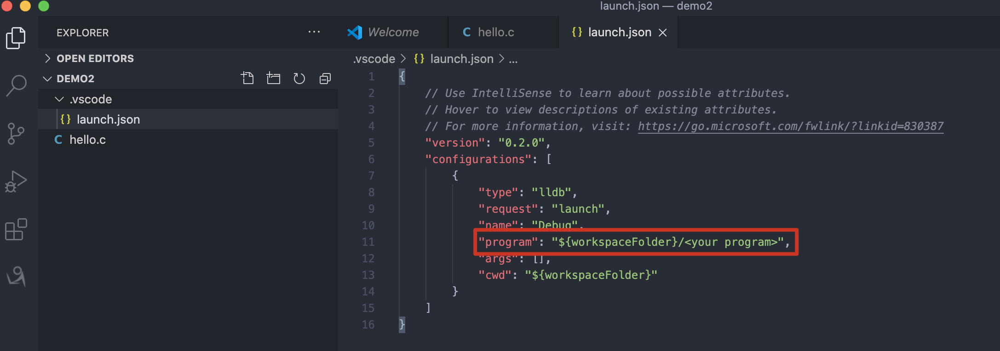
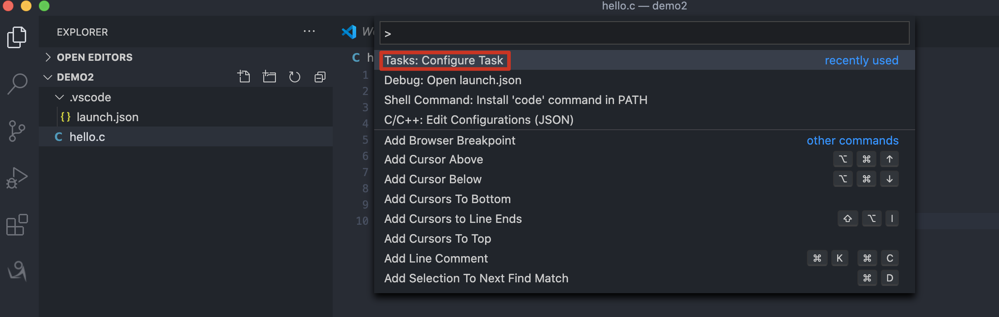
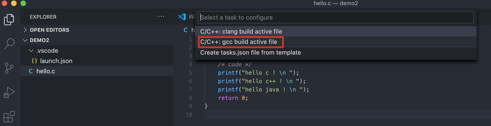
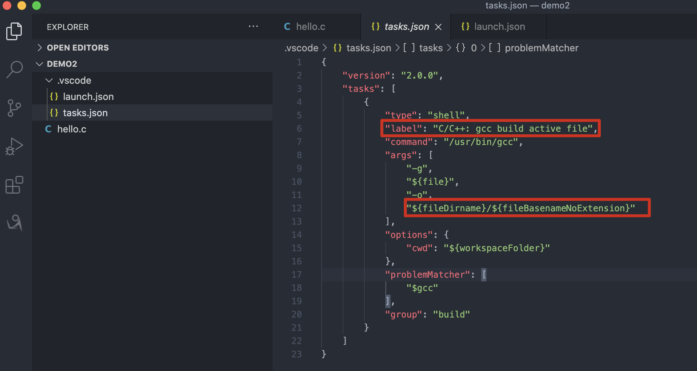
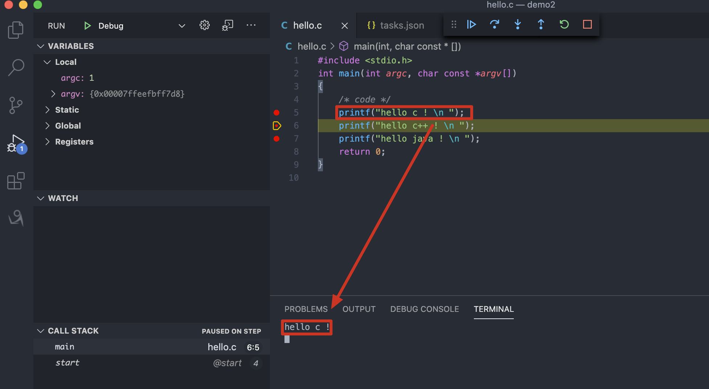


