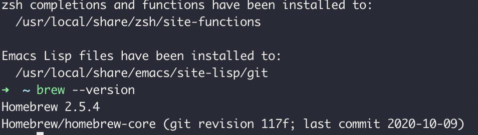
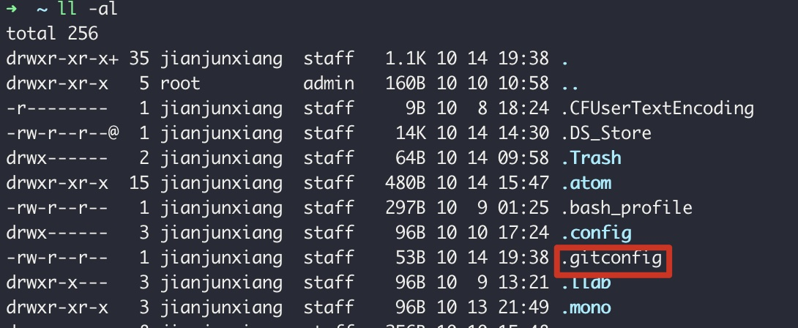
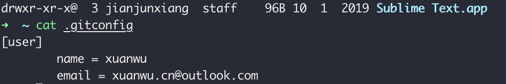
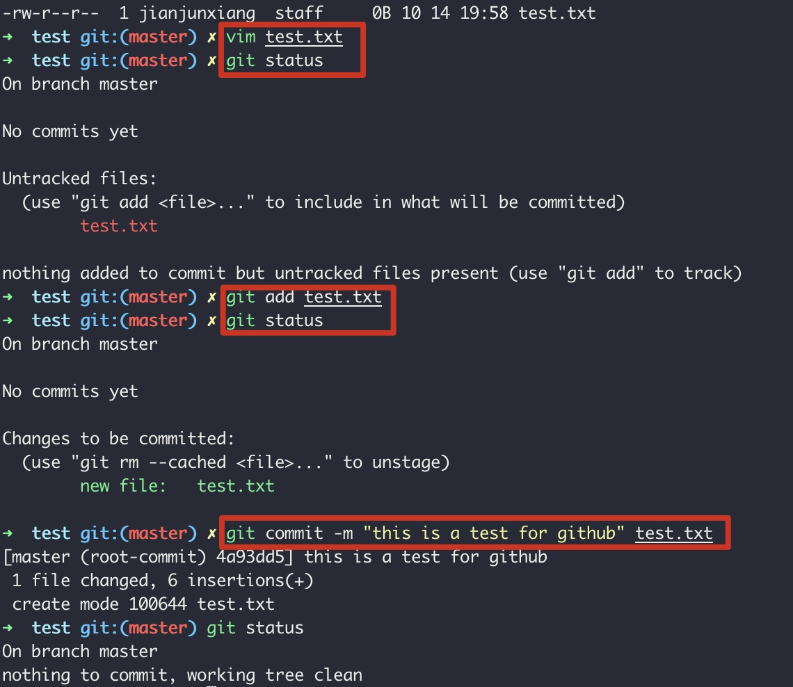
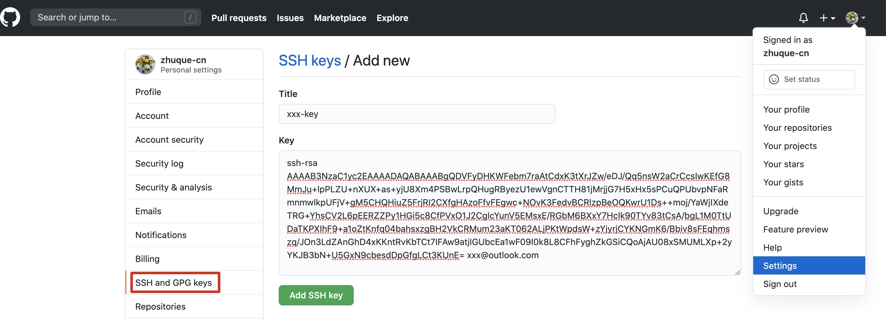

# <center>如何在纯净的mac中安装并配置git</center>

## 第一步 安装homebrew
- 方法一: 通过官网提供的脚本安装 
`/bin/bash -c "$(curl -fsSL https://raw.githubusercontent.com/Homebrew/install/master/install.sh)"`
- 方法二: 通过脚本(Temp_Brew)切换镜像源安装
`下载安装脚本: https://github.com/zhuque-cn/zhuque-note/blob/master/git-env-mac/Temp_Brew`
`修改镜像源: BREW_REPO = "https://mirrors.tuna.tsinghua.edu.cn/git/homebrew/brew.git".freeze`
`中科大镜像源: https://mirrors.ustc.edu.cn/brew.git`
`阿里镜像源: https://mirrors.aliyun.com/homebrew/brew.git`
`清华镜像源: https://mirrors.tuna.tsinghua.edu.cn/git/homebrew/brew.git`
`参考文档: https://www.mintimate.cn/2020/04/05/Homebrew/`


  `执行安装脚本: /usr/bin/ruby Temp_Brew `
  `查看homebrew安装情况: brew -v`

## 第二步 安装git并配置git
- 安装git
`brew install git`
`git -v`


- 配置git(用户级别),配置完成生成.gitconfig文件
`git config --global user.name zhuque`
`git config --global user.name zhuque.cn@outlook.com`



- 注册GitHub账户
- 本地创建仓库(以test为例)
```shell
  创建仓库: mkdir test
  切换至仓库: cd test
  初始化仓库: git init
  编辑文档: vim test.txt
  将文档存添加到暂存区: git add test.txt
  将暂存区问道添加到本地仓库: git commit -m "this is a test for github" test.txt
  查看仓库状态: git status
```

- 将本地仓库推送到远程仓库
```shell
第一类: 通过https访问推送
方法1: 直接推送到仓库地址: git push https://github.com/zhuque-cn/test2.git master
方法2: 将远程仓库地址别名: git remote https://github.com/zhuque-cn/test2.git origin  再通过别名推送至远程仓库: git push origin master

第二类: 通过ssh访问推送
切换到根目录: cd ~
删除原有的.ssh: rm -rf .ssh(注意有必要的需要备份)
重新生成.ssh文件: ssh-keygen -t rsa -C zhuque-cn@outlook.com
将生成秘钥id_rsa.pub中的内容拷贝到github账户>setting>SSH and GPG keys>SSH keys中
```
 
