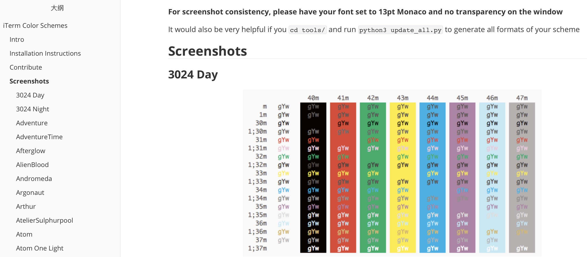
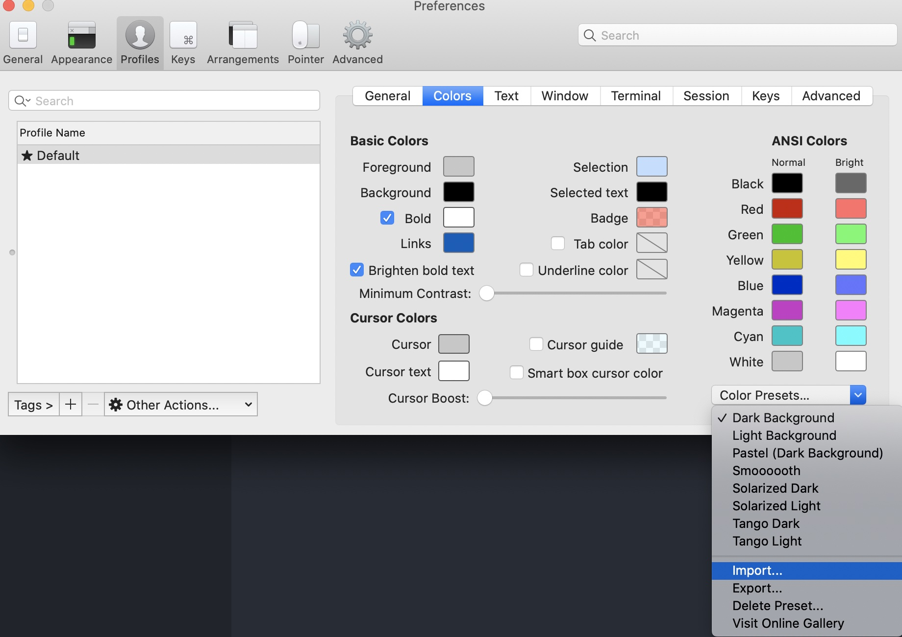
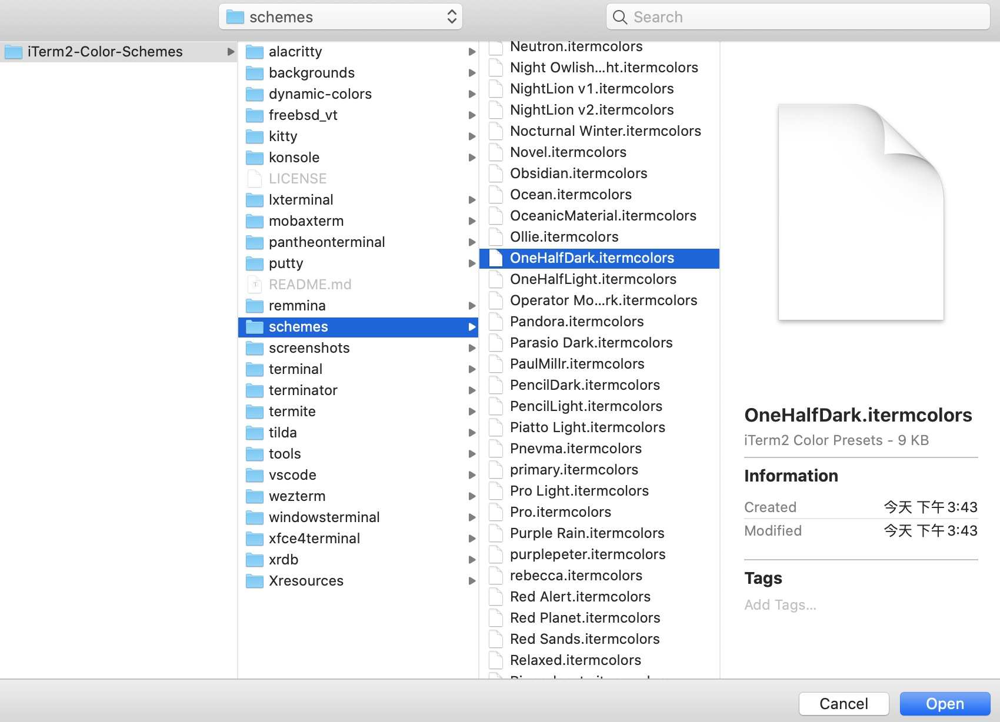
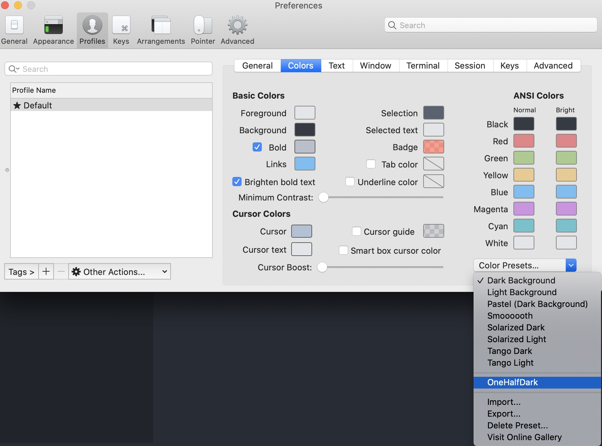
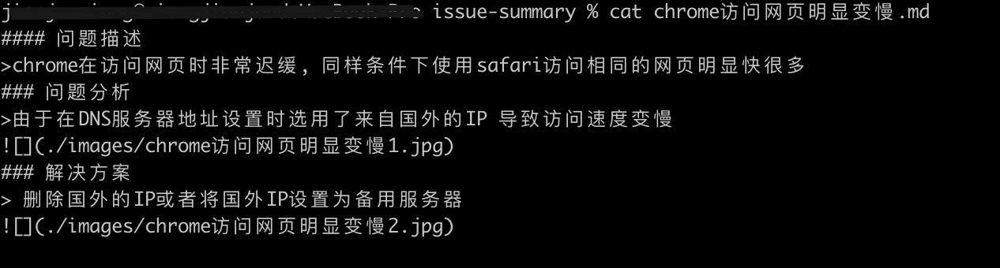
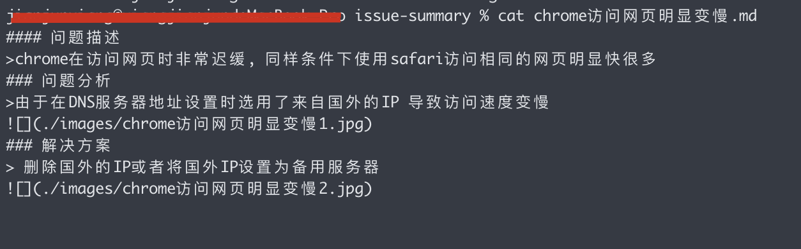
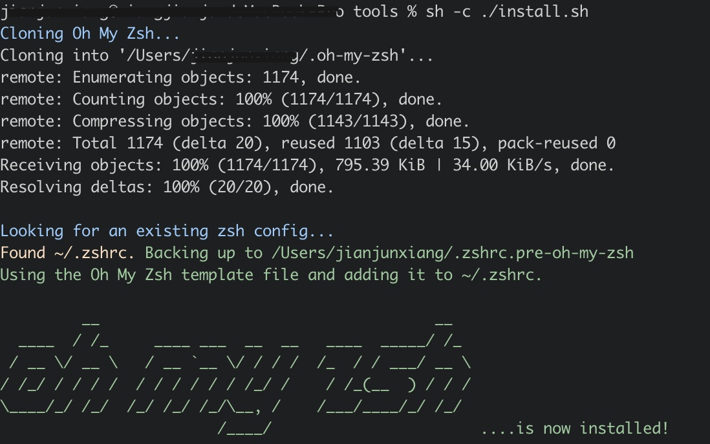
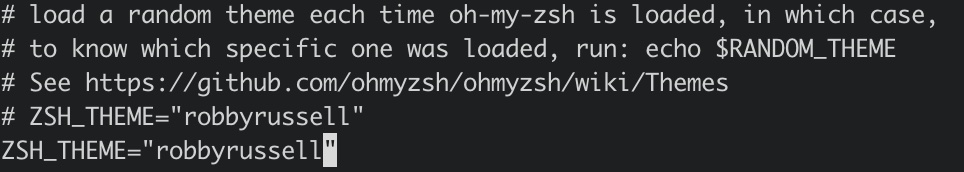
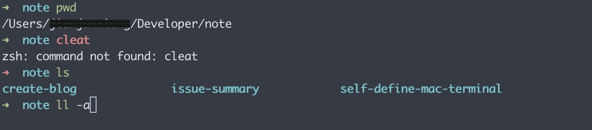

## 
如何通过iterm2优化Mac终端

#### 第一步 下载安装iterm2
官网下载iterms2安装包解压安装:  下载地址: https://www.iterm2.com/

### 第二步 下载iterms2主题
由于GitHub下载资源较慢,可直接在gitee上下载  下载地址: https://gitee.com/firstover/iTerm2-Color-Schemes.git
- 切换到自己的仓库 : `cd repository`
- 下载主题: `git clone https://gitee.com/firstover/iTerm2-Color-Schemes.git`

### 第三步 设置自己喜欢的主题
在iTerm2-Color-Schemes查看自己喜欢的主题: 
`cd iTerm2-Color-Schemes ----> open ./ ----> README.md`

- 主题效果可参考: https://sspai.com/post/53008  
- 个人推荐选择: One Half Dark 

选择自己喜欢的主题
- 进入iterm2的打开preference设置: `打开iterm2 ----> command + ,`
- 选择喜欢的主题: 

- 设置完成前后效果对比

### 第四步 下载安装oh-my-zsh
> 目前常用的 Linux系统和OSX系统的默认Shell都是bash, 「oh my zsh」是强化的Shell  
- 下载地址: https://gitee.com/mirrors/oh-my-zsh.git
- 安装oh-my-zsh: 
`cd /oh-my-zsh/tools`
`sh -c install.sh`

- 安装完成返回根目录查看发现增加了两个文件: `.zshrc.pre-oh-my-zsh   .zshrc`
- 修改根目录下的.zshrc文件
`vim .zshrc`
`ZSH_THEME="robbyrussell"`

### 第五步 配置代码高亮和自动补全功能插件
- 切换到插件目录: `cd /Users/XXX/.oh-my-zsh/plugins`
- 下载代码高亮插件: `git clone https://gitee.com/ernestguo/zsh-syntax-highlighting.git`
- 下载代码自动补全插件: `git clone https://gitee.com/dongege/zsh-autosuggestions.git`
- 修改根目录下的.zshrc文件
`cd ~`
`vim .zshrc`
`plugins=(git zsh-syntax-highlighting zsh-autosuggestions)`
`source .zshrc`
### 最终效果

